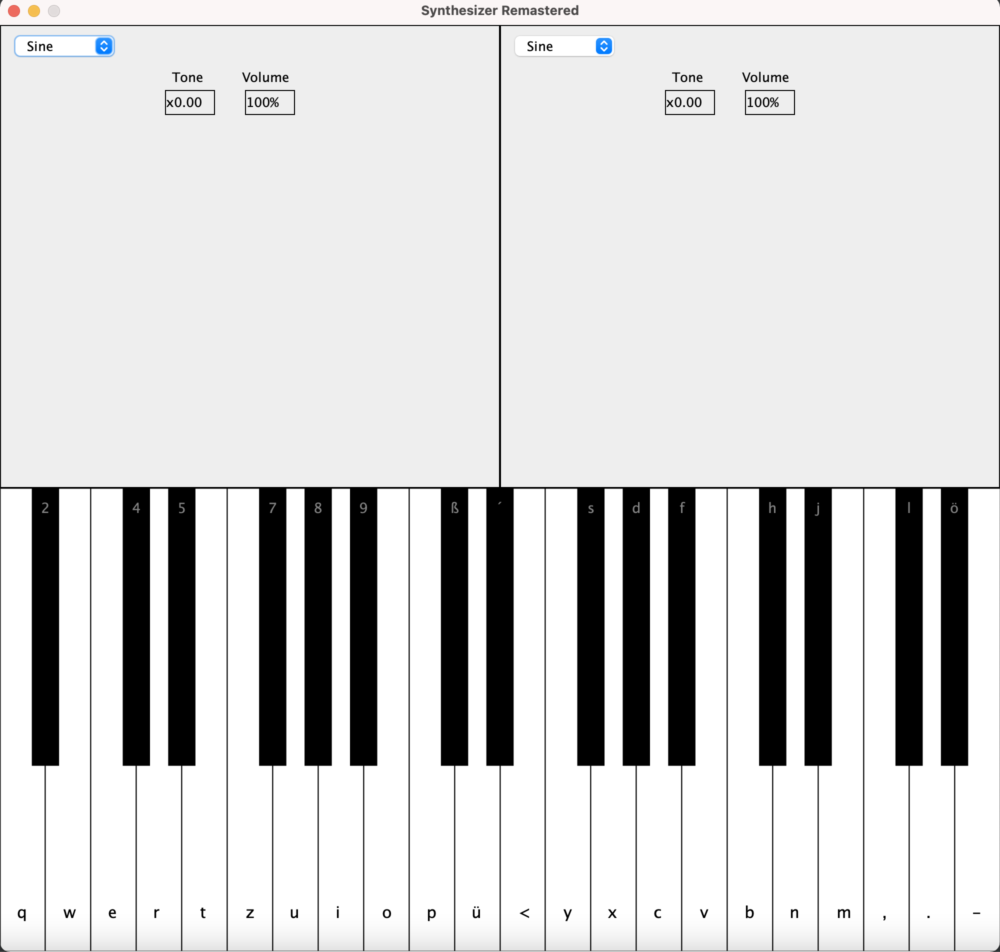

# AUDIO SYNTHESIZER

This project is still a WIP and it is my attempt to develop my own synth. Initially simple functions such a piano roll, octave switch and pitch manipulation as well as oscillator controlls will be implemented. 

## Instructions
In order to run the project you should have Maven and Java 10 installed on your machine. To run the project you should navigate to the project folder and run the **Main.java** class.

## Description
This project is a digital synthesizer which allows synthesizing sounds from two oscillators at the same time. The functions that are included in this synth so far are:

- Changing the waveform of the oscillator: The user can choose between **Sine**, **Square**, **Triangle**, **Sav** and **Noise** waveforms.
- Manipulating the volume of each oscillator.
- Manipulating the pitch (tone) of each oscillator.
- Using computer keyboard control for the playing of the synth keys. Each synth key has written on it the correspondent computer keyboard key (the mapping corresponds to a german computer keyboard).

## TODO
- Beautify code
- Add comments around the logic used behind oscillators
- Add low pass & high pass filter
- Add octave manipulation
- Enrich docs
